```mermaid
flowchart TB
    subgraph upstream["Dependants (2)"]
        P1["<b>📦&nbsp;SayedHa.Commands.csproj</b><br/><small>net8.0</small>"]
        P3["<b>📦&nbsp;SayedHa.Commands.Test.csproj</b><br/><small>net8.0</small>"]
        click P1 "#sayedhacommandssayedhacommandscsproj"
        click P3 "#sayedhacommandstestsayedhacommandstestcsproj"
    end
    subgraph current["SayedHa.Commands.Shared.csproj"]
        MAIN["<b>📦&nbsp;SayedHa.Commands.Shared.csproj</b><br/><small>net8.0</small>"]
        click MAIN "#sayedhacommandssharedsayedhacommandssharedcsproj"
    end
    P1 --> MAIN
    P3 --> MAIN

```

```mermaid
flowchart TB
    subgraph current["SayedHa.Commands.Test.csproj"]
        MAIN["<b>📦&nbsp;SayedHa.Commands.Test.csproj</b><br/><small>net8.0</small>"]
        click MAIN "#sayedhacommandstestsayedhacommandstestcsproj"
    end
    subgraph downstream["Dependencies (2"]
        P2["<b>📦&nbsp;SayedHa.Commands.Shared.csproj</b><br/><small>net8.0</small>"]
        P1["<b>📦&nbsp;SayedHa.Commands.csproj</b><br/><small>net8.0</small>"]
        click P2 "#sayedhacommandssharedsayedhacommandssharedcsproj"
        click P1 "#sayedhacommandssayedhacommandscsproj"
    end
    MAIN --> P2
    MAIN --> P1

```

```mermaid
flowchart TB
    subgraph upstream["Dependants (1)"]
        P3["<b>📦&nbsp;SayedHa.Commands.Test.csproj</b><br/><small>net8.0</small>"]
        click P3 "#sayedhacommandstestsayedhacommandstestcsproj"
    end
    subgraph current["SayedHa.Commands.csproj"]
        MAIN["<b>📦&nbsp;SayedHa.Commands.csproj</b><br/><small>net8.0</small>"]
        click MAIN "#sayedhacommandssayedhacommandscsproj"
    end
    subgraph downstream["Dependencies (1"]
        P2["<b>📦&nbsp;SayedHa.Commands.Shared.csproj</b><br/><small>net8.0</small>"]
        click P2 "#sayedhacommandssharedsayedhacommandssharedcsproj"
    end
    P3 --> MAIN
    MAIN --> P2

```

# Projects and dependencies analysis

This document provides a comprehensive overview of the projects and their dependencies in the context of upgrading to .NETCoreApp,Version=v10.0.

## Table of Contents

- [Executive Summary](#executive-Summary)
  - [Highlevel Metrics](#highlevel-metrics)
  - [Projects Compatibility](#projects-compatibility)
  - [Package Compatibility](#package-compatibility)
  - [API Compatibility](#api-compatibility)
- [Aggregate NuGet packages details](#aggregate-nuget-packages-details)
- [Top API Migration Challenges](#top-api-migration-challenges)
  - [Technologies and Features](#technologies-and-features)
  - [Most Frequent API Issues](#most-frequent-api-issues)
- [Projects Relationship Graph](#projects-relationship-graph)
- [Project Details](#project-details)

  - [SayedHa.Commands.Shared\SayedHa.Commands.Shared.csproj](#sayedhacommandssharedsayedhacommandssharedcsproj)
  - [SayedHa.Commands.Test\SayedHa.Commands.Test.csproj](#sayedhacommandstestsayedhacommandstestcsproj)
  - [SayedHa.Commands\SayedHa.Commands.csproj](#sayedhacommandssayedhacommandscsproj)

## Executive Summary

### Highlevel Metrics

| Metric | Count | Status |
| :--- | :---: | :--- |
| Total Projects | 3 | All require upgrade |
| Total NuGet Packages | 10 | 3 need upgrade |
| Total Code Files | 45 |  |
| Total Code Files with Incidents | 12 |  |
| Total Lines of Code | 2204 |  |
| Total Number of Issues | 31 |  |
| Estimated LOC to modify | 24+ | at least 1.1% of codebase |

### Projects Compatibility

| Project | Target Framework | Difficulty | Package Issues | API Issues | Est. LOC Impact | Description |
| :--- | :---: | :---: | :---: | :---: | :---: | :--- |
| [SayedHa.Commands.Shared\SayedHa.Commands.Shared.csproj](#sayedhacommandssharedsayedhacommandssharedcsproj) | net8.0 | 🟢 Low | 2 | 11 | 11+ | ClassLibrary, Sdk Style = True |
| [SayedHa.Commands.Test\SayedHa.Commands.Test.csproj](#sayedhacommandstestsayedhacommandstestcsproj) | net8.0 | 🟢 Low | 0 | 0 |  | DotNetCoreApp, Sdk Style = True |
| [SayedHa.Commands\SayedHa.Commands.csproj](#sayedhacommandssayedhacommandscsproj) | net8.0 | 🟢 Low | 2 | 13 | 13+ | DotNetCoreApp, Sdk Style = True |

### Package Compatibility

| Status | Count | Percentage |
| :--- | :---: | :---: |
| ✅ Compatible | 7 | 70.0% |
| ⚠️ Incompatible | 1 | 10.0% |
| 🔄 Upgrade Recommended | 2 | 20.0% |
| ***Total NuGet Packages*** | ***10*** | ***100%*** |

### API Compatibility

| Category | Count | Impact |
| :--- | :---: | :--- |
| 🔴 Binary Incompatible | 0 | High - Require code changes |
| 🟡 Source Incompatible | 23 | Medium - Needs re-compilation and potential conflicting API error fixing |
| 🔵 Behavioral change | 1 | Low - Behavioral changes that may require testing at runtime |
| ✅ Compatible | 3196 |  |
| ***Total APIs Analyzed*** | ***3220*** |  |

## Aggregate NuGet packages details

| Package | Current Version | Suggested Version | Projects | Description |
| :--- | :---: | :---: | :--- | :--- |
| LibGit2Sharp | 0.26.0 |  | [SayedHa.Commands.Shared.csproj](#sayedhacommandssharedsayedhacommandssharedcsproj) | ⚠️NuGet package is deprecated |
| McMaster.Extensions.CommandLineUtils | 2.3.4 |  | [SayedHa.Commands.csproj](#sayedhacommandssayedhacommandscsproj) [SayedHa.Commands.Shared.csproj](#sayedhacommandssharedsayedhacommandssharedcsproj) | ✅Compatible |
| Microsoft.Extensions.DependencyInjection | 8.0.0 | 10.0.1 | [SayedHa.Commands.csproj](#sayedhacommandssayedhacommandscsproj) [SayedHa.Commands.Shared.csproj](#sayedhacommandssharedsayedhacommandssharedcsproj) | NuGet package upgrade is recommended |
| Microsoft.NET.Test.Sdk | 16.0.1 |  | [SayedHa.Commands.Test.csproj](#sayedhacommandstestsayedhacommandstestcsproj) | ✅Compatible |
| Moq | 4.13.0 |  | [SayedHa.Commands.Test.csproj](#sayedhacommandstestsayedhacommandstestcsproj) | ✅Compatible |
| Spectre.Console | 0.43.0 |  | [SayedHa.Commands.csproj](#sayedhacommandssayedhacommandscsproj) | ✅Compatible |
| System.Security.Cryptography.ProtectedData | 8.0.0 | 10.0.1 | [SayedHa.Commands.csproj](#sayedhacommandssayedhacommandscsproj) | NuGet package upgrade is recommended |
| TextCopy | 1.5.2 |  | [SayedHa.Commands.csproj](#sayedhacommandssayedhacommandscsproj) | ✅Compatible |
| xunit | 2.4.0 |  | [SayedHa.Commands.Test.csproj](#sayedhacommandstestsayedhacommandstestcsproj) | ✅Compatible |
| xunit.runner.visualstudio | 2.4.0 |  | [SayedHa.Commands.Test.csproj](#sayedhacommandstestsayedhacommandstestcsproj) | ✅Compatible |

## Top API Migration Challenges

### Technologies and Features

| Technology | Issues | Percentage | Migration Path |
| :--- | :---: | :---: | :--- |

### Most Frequent API Issues

| API | Count | Percentage | Category |
| :--- | :---: | :---: | :--- |
| M:System.Exception.#ctor(System.Runtime.Serialization.SerializationInfo,System.Runtime.Serialization.StreamingContext) | 10 | 41.7% | Source Incompatible |
| T:System.Security.Cryptography.DataProtectionScope | 4 | 16.7% | Source Incompatible |
| M:System.Net.WebClient.#ctor | 3 | 12.5% | Source Incompatible |
| F:System.Security.Cryptography.DataProtectionScope.CurrentUser | 2 | 8.3% | Source Incompatible |
| T:System.Security.Cryptography.ProtectedData | 2 | 8.3% | Source Incompatible |
| M:System.Security.Cryptography.ProtectedData.Protect(System.Byte[],System.Byte[],System.Security.Cryptography.DataProtectionScope) | 2 | 8.3% | Source Incompatible |
| T:System.Net.Http.HttpContent | 1 | 4.2% | Behavioral Change |

## Projects Relationship Graph

Legend:
📦 SDK-style project
⚙️ Classic project

```mermaid
flowchart LR
    P1["<b>📦&nbsp;SayedHa.Commands.csproj</b><br/><small>net8.0</small>"]
    P2["<b>📦&nbsp;SayedHa.Commands.Shared.csproj</b><br/><small>net8.0</small>"]
    P3["<b>📦&nbsp;SayedHa.Commands.Test.csproj</b><br/><small>net8.0</small>"]
    P1 --> P2
    P3 --> P2
    P3 --> P1
    click P1 "#sayedhacommandssayedhacommandscsproj"
    click P2 "#sayedhacommandssharedsayedhacommandssharedcsproj"
    click P3 "#sayedhacommandstestsayedhacommandstestcsproj"

```

## Project Details

### SayedHa.Commands.Shared\SayedHa.Commands.Shared.csproj

#### Project Info

- **Current Target Framework:** net8.0
- **Proposed Target Framework:** net10.0
- **SDK-style**: True
- **Project Kind:** ClassLibrary
- **Dependencies**: 0
- **Dependants**: 2
- **Number of Files**: 24
- **Number of Files with Incidents**: 7
- **Lines of Code**: 852
- **Estimated LOC to modify**: 11+ (at least 1.3% of the project)

#### Dependency Graph

Legend:
📦 SDK-style project
⚙️ Classic project

### API Compatibility

| Category | Count | Impact |
| :--- | :---: | :--- |
| 🔴 Binary Incompatible | 0 | High - Require code changes |
| 🟡 Source Incompatible | 11 | Medium - Needs re-compilation and potential conflicting API error fixing |
| 🔵 Behavioral change | 0 | Low - Behavioral changes that may require testing at runtime |
| ✅ Compatible | 1031 |  |
| ***Total APIs Analyzed*** | ***1042*** |  |

### SayedHa.Commands.Test\SayedHa.Commands.Test.csproj

#### Project Info

- **Current Target Framework:** net8.0
- **Proposed Target Framework:** net10.0
- **SDK-style**: True
- **Project Kind:** DotNetCoreApp
- **Dependencies**: 2
- **Dependants**: 0
- **Number of Files**: 4
- **Number of Files with Incidents**: 1
- **Lines of Code**: 245
- **Estimated LOC to modify**: 0+ (at least 0.0% of the project)

#### Dependency Graph

Legend:
📦 SDK-style project
⚙️ Classic project

### API Compatibility

| Category | Count | Impact |
| :--- | :---: | :--- |
| 🔴 Binary Incompatible | 0 | High - Require code changes |
| 🟡 Source Incompatible | 0 | Medium - Needs re-compilation and potential conflicting API error fixing |
| 🔵 Behavioral change | 0 | Low - Behavioral changes that may require testing at runtime |
| ✅ Compatible | 239 |  |
| ***Total APIs Analyzed*** | ***239*** |  |

### SayedHa.Commands\SayedHa.Commands.csproj

#### Project Info

- **Current Target Framework:** net8.0
- **Proposed Target Framework:** net10.0
- **SDK-style**: True
- **Project Kind:** DotNetCoreApp
- **Dependencies**: 1
- **Dependants**: 1
- **Number of Files**: 17
- **Number of Files with Incidents**: 4
- **Lines of Code**: 1107
- **Estimated LOC to modify**: 13+ (at least 1.2% of the project)

#### Dependency Graph

Legend:
📦 SDK-style project
⚙️ Classic project

### API Compatibility

| Category | Count | Impact |
| :--- | :---: | :--- |
| 🔴 Binary Incompatible | 0 | High - Require code changes |
| 🟡 Source Incompatible | 12 | Medium - Needs re-compilation and potential conflicting API error fixing |
| 🔵 Behavioral change | 1 | Low - Behavioral changes that may require testing at runtime |
| ✅ Compatible | 1926 |  |
| ***Total APIs Analyzed*** | ***1939*** |  |

